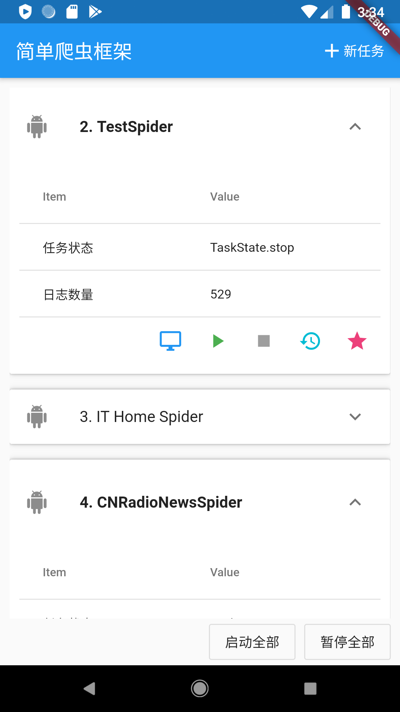
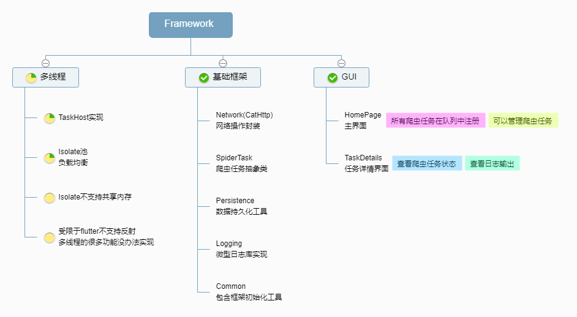
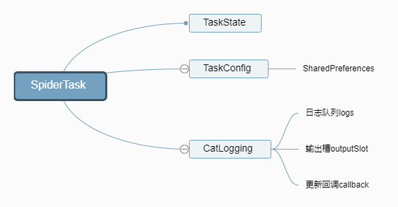
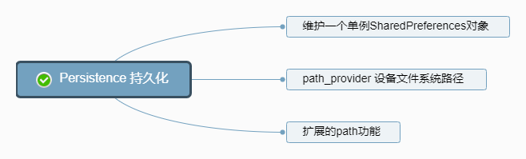

# flutter_spider_fx MT
Flutter爬虫框架，帮助开发者快速在移动设备上构建爬虫，单线程版本

详情请见博客文章：https://zhuanlan.zhihu.com/p/108028434

## 截图

## 架构

SpiderTask基类，所有爬虫类都从这个类派生，SpiderTask内自己维护一个TaskConfig任务配置对象和一个日志对象。如下图：

至于数据持久化的，我用了另外一个类，采用单例模式，在app启动的时候初始化。

## 参考资料
- dart语法学习：https://juejin.im/post/5d7caa75f265da039a28b6b7
- path_provider博客：https://juejin.im/post/5c7f2f2ae51d4575d911172a
- 如何在Flutter上优雅地序列化一个对象：http://blog.itpub.net/69900359/viewspace-2565154/
- Flutter Isolate并发编程：http://blog.hacktons.cn/2019/07/11/flutter-isolate/
- DataTable参考：
    - Flutter之DataTable使用详解：https://juejin.im/post/5b73841951882561086e4906
    - https://www.cnblogs.com/buchizaodian/p/10831409.html
- [译] Flutter 核心概念详解： Widget、State、Context 及 InheritedWidget：https://juejin.im/post/5c768ad2f265da2dce1f535c

## 遇到的问题
- 问题：Illegal argument in isolate message : (object is a regular Dart Instance)

>解答：Sending an object entails serializing all it's fields, you are sending object1 which is a Worker object, one of it's fields is externalReference which is of Type ExternalClass and one of the fields of ExternalClass is a closure (_internalClosure).

所以我决定弃坑了，这个版本还是做成单线程的就好。

至于多线程，我会在另一个版本做。

## license
GPL v2

## 欢迎交流
我整理了一系列的技术文章和资料，在公众号「程序设计实验室」后台回复 linux、flutter、c#、netcore、android、java、python 等可获取相关技术文章和资料，同时有任何问题都可以在公众号后台留言~